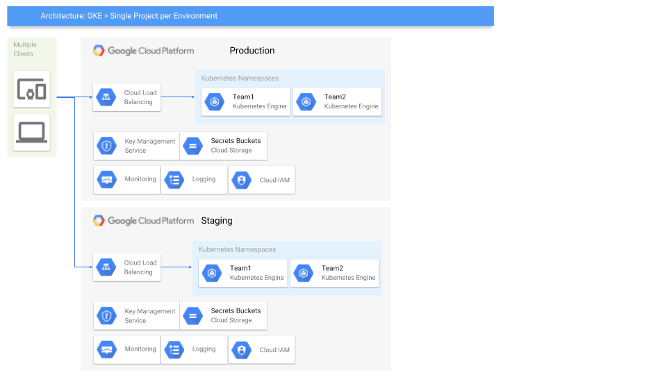

# Kubernetes - Happily in Production

**!NOTE! This is still under development, I haven't yet pushed all the parts**

This is a repository that one can use as an base to run Kubernetes cluster inside Google Cloud Platform.
It is a collection of best practises around security and networking that I usually use when deploying
K8s clusters.

## Before running anything in this repository

### Prerequisities

You need to have the following tools installed before continuing

- [Google Cloud SDK](https://cloud.google.com/sdk/)

### Configure the environment

You should modify the base details in the init.environment -files.
and you can modify the environment specifics in the [ENV].environment files.

***Set your Google Cloud related information**

| Environment variable | Description                                 |
|----------------------|---------------------------------------------|
| ORGANIZATION_ID      | ID of your GCP Organisation (empty if none) |
| BILLING_ID           | Your GCP Billing ID                         |
| PROJECT_ID_SUFFIX    | Suffix for your project IDs                 |

### Load the environment variables

```sh
export ENV=dev # dev, test, stg, prod
source init.environment
```

## Setup info

This repository has been broken down to few different folders.
It also includes a Presentation related to this particular setup.

There are multiple ways one can configure their GCP Resources and Kubernetes Engine clusters.
This repo shows one of these ways that is based on a architecture like this:


